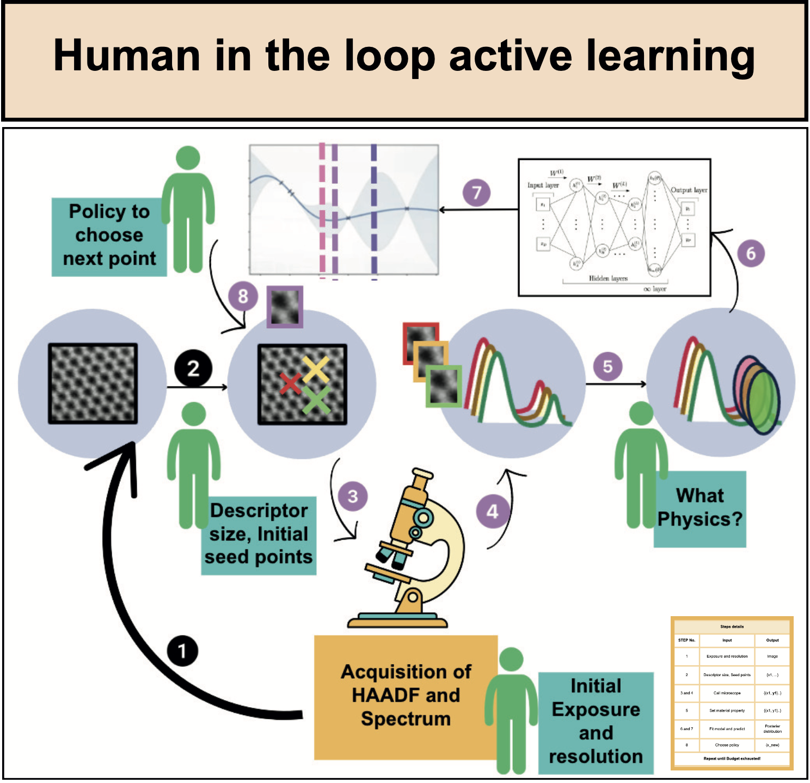

## 

    <a href="https://research.utk.edu/oried/research-innovation-initiatives/ai-tennessee-initiative/">
        

At UT Knoxville, I am part of the [AESPM_group](https://ae-spm.utk.edu/). In my role as a Graduate Research Assistant, I'm harnessing the power of machine learning to fast-track materials discovery. My primary aim is to create automated workflows for microscopes(STEM and SPM). This endeavor is guided by Dr. [Sergei](https://scholar.google.co.in/citations?user=-cuxoSQAAAAJ&hl=en) in collaboration with [ORNL](https://www.ornl.gov/).  

I earned my Bachelor's and Master's degree in Material Science from the [Indian Institute of Science](https://iisc.ac.in/). As my bachelor's thesis I  used First Principles to investigate the electronic properties of Lanthana. As part of my masters thesis I built software interface for characterizing ions toxicity. Here I realised I like to build software which accelarates scientific discovery. Post my academic journey, I enriched my professional expertise as a Research Engineer at [Mindtree Limited](https://www.ltimindtree.com/). Here, I honed my skills in computer vision, natural language processing, and forecasting time series data. I try to keep myself up to date with current ML research both at hands on and theoretically.

Please reach out to me for collaborations, research opportunities, or just to chat about the latest in AI and materials science. I'm always eager to learn and share knowledge. 

Keywords: Bayesian Optimization, Gaussian processes, Active learning, ML for science.

links:
[Google_scholar](https://scholar.google.com/citations?user=BqhnGGAAAAAJ&hl=en) ||
[Github](https://github.com/utkarshp1161) ||
[Linkedin](https://www.linkedin.com/in/utkarsh-pratiush-376ab6171/) ||
[Email](mailto:upratius@vols.edu.utk)

<!-- Write your biography here. Tell the world about yourself. Link to your favorite [subreddit](http://reddit.com). You can put a picture in, too. The code is already in, just name your picture `prof_pic.jpg` and put it in the `img/` folder.

Put your address / P.O. box / other info right below your picture. You can also disable any these elements by editing `profile` property of the YAML header of your `_pages/about.md`. Edit `_bibliography/papers.bib` and Jekyll will render your [publications page](/UtkarshsAIInScience.github.io/publications/) automatically.

Link to your social media connections, too. This theme is set up to use [Font Awesome icons](http://fortawesome.github.io/Font-Awesome/) and [Academicons](https://jpswalsh.github.io/academicons/), like the ones below. Add your Facebook, Twitter, LinkedIn, Google Scholar, or just disable all of them. -->
